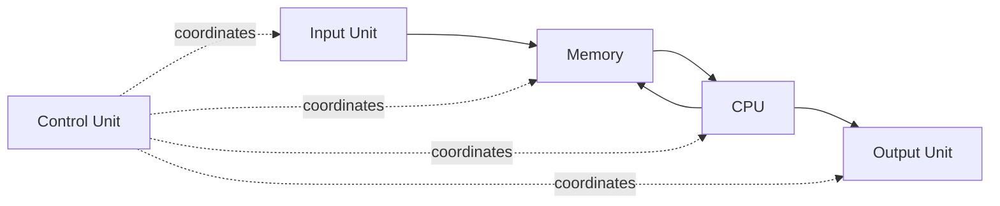
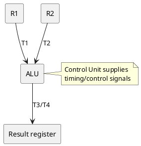

# 1. 🖥️ Basic Structure of a Computer

**Source slides:** 2--18.

## Core idea

A computer performs four fundamental functions:

1.  **Data processing**
2.  **Data storage**
3.  **Data movement**
4.  **Control**

The functional units cooperate to accept input, store program/data,
process it, and produce output. The **Control Unit** coordinates the
other units.

## Understand it

The source describes the main functional units as:

-   **Input Unit**
-   **Output Unit**
-   **Memory**
-   **CPU**
    -   ALU
    -   Control Unit
    -   Registers
-   **Bus Structure**

### What each part contributes

  -----------------------------------------------------------------------
  Unit                                Role
  ----------------------------------- -----------------------------------
  **Input**                           Brings information into the
                                      computer.

  **Memory**                          Stores instructions and data.

  **ALU**                             Performs arithmetic and logical
                                      operations.

  **Registers**                       Very fast temporary storage inside
                                      the CPU.

  **Control Unit**                    Coordinates operations and timing.

  **Output**                          Converts processed binary
                                      information into a form understood
                                      by an output device.

  **Bus**                             Provides communication paths
                                      between units.
  -----------------------------------------------------------------------

### The key distinction: WHAT vs WHEN

The source states:

-   **Instructions control "what" operation takes place.**
-   The **Control Unit generates timing signals** that determine "when"
    an operation takes place.

That distinction explains why the CPU can execute a single instruction
as several smaller hardware actions.

## Example: `ADD R1, R2`

The source breaks the operation into timing steps:

  Clock step   Control action
  ------------ ---------------------------------------
  `T1`         Enable `R1`
  `T2`         Enable `R2`
  `T3`         Enable ALU for addition
  `T4`         Enable ALU output to store the result

### PlantUML view

The important mental model is:

> **Instruction = requested operation; Control Unit = orchestrator; ALU
> = operator; registers = fast working storage.**

## What to remember

### Must understand

-   `CPU = ALU + Control Unit + Registers` in this material.
-   ALU performs arithmetic/logic.
-   Control Unit coordinates and times operations.
-   Registers temporarily hold data/results and speed up CPU operation.

### Must remember

-   Four computer functions: **processing, storage, movement, control**.

### Low priority

The source's long list of computer types (microcomputer, laptop,
workstation, supercomputer, mainframe, hand-held, multicore). Know the
broad idea, but do not spend much study time memorizing descriptions.

## Quick check

1.  If the ALU knows how to add, why is the Control Unit still
    necessary?
2.  Which part answers **"what operation?"** and which part answers
    **"when?"**?
3.  Why are registers useful if memory already stores the data?
