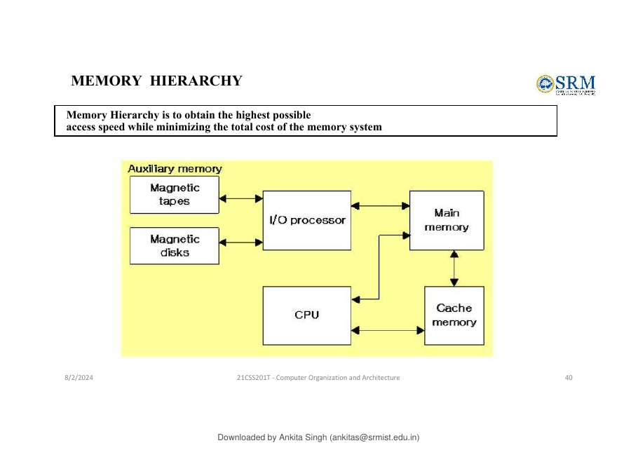
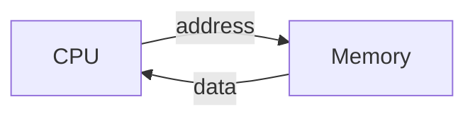
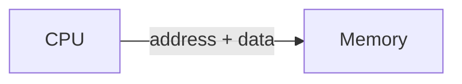

# 4. 🧠 Memory Organization

**Source slides:** 39--48.

## Core idea

Memory is a collection of uniquely identifiable **locations**. Each
location has an **address**, and data is transferred in groups called
**words**.

## Memory hierarchy

The source states the goal of memory hierarchy as:

> obtain the highest possible access speed while minimizing total
> memory-system cost.



The source diagram shows: - auxiliary memory (magnetic tapes/disks) -
I/O processor - main memory - cache memory - CPU

The conceptual trade-off is:

``` text
Need: high speed + reasonable cost
          ↓
Use different levels/types of memory
```

## Memory locations and words

The source describes memory as storage cells, each capable of storing
one bit.

Data is normally accessed in groups of bits called **words**.

Examples from the source: - 8-bit word - 16-bit word - 32-bit word -
64-bit word

An 8-bit word is called a **byte**.

## Address space

Each memory location has a unique address.

The **address space** is the total number of uniquely identifiable
locations.

For a byte-addressable memory with $x$ address bits:

$$
\text{number of locations} = 2^x
$$

and therefore:

$$
x = \log_2(\text{number of locations})
$$

### Example 1

A computer has **32 MB** of memory and each address identifies one byte.

Since:

$$
32\text{ MB}=32\times2^{20}=2^5\times2^{20}=2^{25}
$$

we need:

$$
\boxed{25\text{ address bits}}
$$

### Example 2

A computer has **128 MB** of memory and each word is **8 bytes**.

Total bytes:

$$
128\text{ MB}=2^{27}\text{ bytes}
$$

Number of words:

$$
\frac{2^{27}}{2^3}=2^{24}
$$

Therefore:

$$
\boxed{24\text{ bits}}
$$

are required to address an individual word.

## Memory operations

The source identifies two basic operations:

### Load / Read / Fetch

> Processor reads the contents of a specified memory location.



### Store / Write

> Processor writes data into a specified memory location.



## The most useful derivation

When asked:

> "How many address bits are needed?"

do **not** memorize examples.

Use:

1.  Find the number of addressable units.
2.  Express it as a power of 2.
3.  Take $\log_2$.

For word-addressable memory:

$$
\text{number of words}
=
\frac{\text{total bytes}}{\text{bytes per word}}
$$

Then:

$$
\text{address bits}=\log_2(\text{number of words})
$$

## What to remember

### Must understand

-   Address identifies a memory location.
-   Address space = number of uniquely addressable locations.
-   Word = group of bits accessed as a unit.
-   Load = memory → processor.
-   Store = processor → memory.

### Must remember

$$
2^x=n
$$

### Quick check

1.  A byte-addressable memory contains $2^{20}$ bytes. How many address
    bits are required?
2.  If each word is 4 bytes, does the number of *bytes* and the number
    of *words* in the address space stay the same?
3.  Why does changing from byte-addressing to word-addressing change the
    number of address bits?
