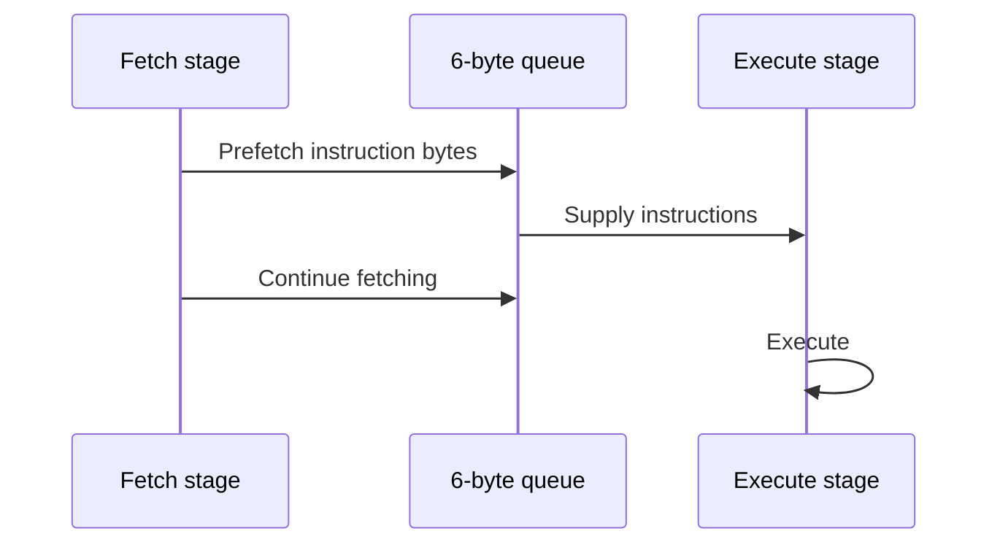
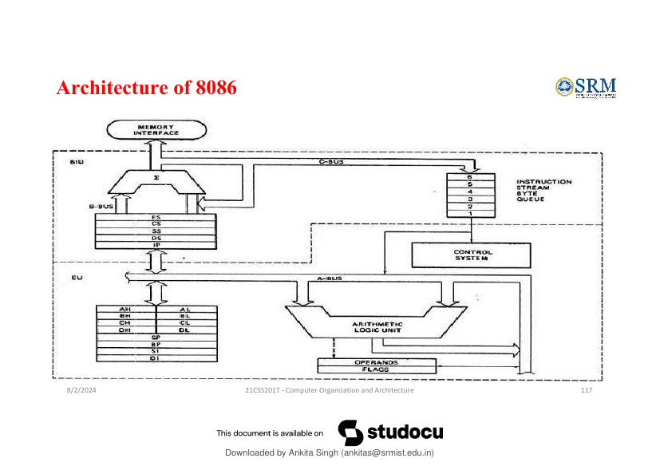

# 10. 🧱 8086 Architecture and Registers

**Source slides:** 115--126.

## Core idea

The source uses the **8086** as a case study to apply the general ideas
of CPU structure, registers, buses, instruction execution, and memory
organization.

## 8086 facts from the source

-   16-bit microprocessor
-   20 address lines
-   16 data lines
-   Up to 1 MB storage
-   Supports multiplication and division instructions
-   Two operating modes:
    -   **Maximum mode** --- suitable for systems with multiple
        processors
    -   **Minimum mode** --- suitable for systems with a single
        processor

> **Source note:** The slide says "designed by Intel in 1976." These
> notes preserve the source statement rather than silently correcting
> it.

## Features emphasized by the source

The 8086 has:

-   a **six-instruction-byte queue**
-   16-bit ALU
-   16-bit registers
-   16-bit internal data bus
-   16-bit external data bus
-   two pipeline stages:
    1.  Fetch
    2.  Execute

The fetch stage can prefetch up to six instruction bytes and place them
in the queue.

### Why a queue helps

The source's idea is that fetching and executing can overlap:



## 8086 architecture



The source diagram shows major groups including:

-   **BIU** --- Bus Interface Unit
-   **EU** --- Execution Unit
-   segment registers
-   instruction queue
-   control system
-   arithmetic logic unit
-   general-purpose registers
-   operands/flags

The diagram is worth understanding as a **division of responsibility**:

``` text
Bus/memory-facing work ↔ execution work
```

## Segments

The source says memory is divided into sections called **segments**:

  Segment                  Source purpose
  ------------------------ --------------------------
  **Code Segment (CS)**    Program storage
  **Data Segment (DS)**    Data storage
  **Extra Segment (ES)**   Mostly string operations
  **Stack Segment (SS)**   Push/pop operations

## General-purpose registers

### AX --- Accumulator

-   16-bit
-   split into `AH` and `AL`
-   can support 8-bit operations
-   generally used for arithmetic and logic

### BX --- Base register

-   16-bit
-   split into `BH` and `BL`
-   can support 8-bit operations
-   used to store the value of the offset, according to the source

### CX --- Counter register

-   16-bit
-   split into `CH` and `CL`
-   used in looping and rotation

### DX --- Data register

-   16-bit
-   split into `DH` and `DL`
-   used in multiplication and I/O port addressing

## Pointer registers

### SP --- Stack Pointer

-   16-bit
-   points to the topmost item of the stack
-   source states that if the stack is empty, SP is `(FFFE)H`
-   offset relative to the stack segment

### BP --- Base Pointer

-   16-bit
-   used for accessing parameters passed by the stack
-   offset relative to the stack segment

## Index registers

### SI --- Source Index

-   16-bit
-   pointer addressing of data
-   source for some string operations
-   offset relative to data segment

### DI --- Destination Index

-   16-bit
-   pointer addressing of data
-   destination in string operations
-   offset relative to extra segment

## Instruction Pointer

### IP --- Instruction Pointer

-   16-bit
-   stores the address of the next instruction to be executed
-   also acts as an offset for `CS`

Conceptually:

``` text
CS + IP → instruction location
```

## Segment registers

-   **CS** --- Code Segment
-   **DS** --- Data Segment
-   **SS** --- Stack Segment
-   **ES** --- Extra Segment

The source gives special descriptions for each. The important functional
association is:

``` text
CS → code
DS → data
SS → stack
ES → extra/string-related use
```

## Flag/status register

The source says the flag/status register is:

-   16-bit
-   contains 9 flags
-   remaining 7 bits are idle
-   flags indicate processor status after arithmetic/logical operations
-   flag = `1` → set
-   flag = `0` → reset

## Register map

``` text
8086 registers
│
├── General purpose
│   ├── AX
│   ├── BX
│   ├── CX
│   └── DX
│
├── Pointer / index
│   ├── SP
│   ├── BP
│   ├── SI
│   └── DI
│
├── Instruction
│   └── IP
│
├── Segment
│   ├── CS
│   ├── DS
│   ├── SS
│   └── ES
│
└── Flags/status
```

## What to remember

### Must understand

-   8086 is used as the concrete example of the general CPU ideas.
-   The fetch/execute queue improves overlap between fetching and
    execution.
-   Know the functional roles of the register groups.
-   Know the four segment associations.

### Must remember

-   8086: **16-bit**, **20 address lines**, **16 data lines**, **1 MB**
    maximum storage in the source.
-   Instruction queue: **6 bytes**.
-   Pipeline stages: **Fetch + Execute**.

### Low priority

Every historical detail and every exact sentence in the register
descriptions.

## Quick check

1.  Why does the 8086 instruction queue help performance?
2.  Which register points to the next instruction?
3.  Which segment is associated with stack operations?
4.  Which is more appropriate for loop counting: CX or DX, according to
    the source?
