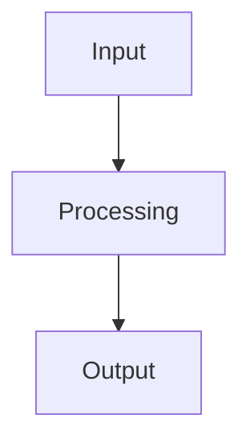
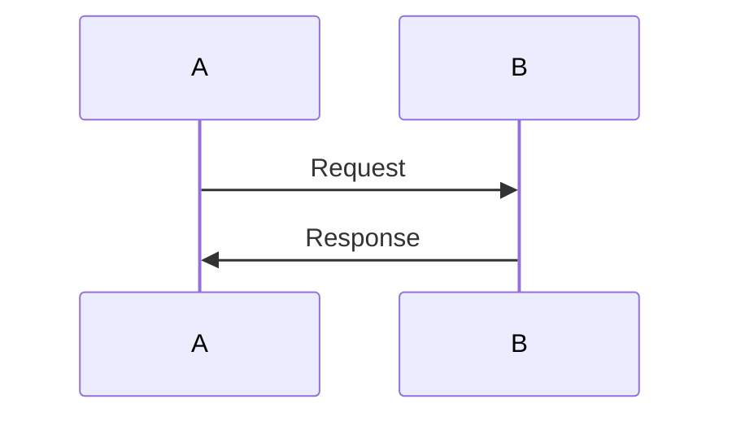
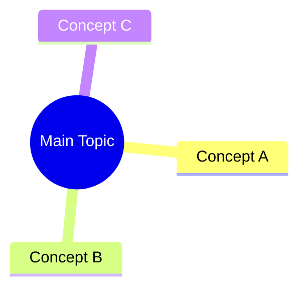

# Universal Study Notes Generation Prompt

I have uploaded study material for a subject/topic. Create a complete, high-quality set of study notes from the uploaded material.

## IMPORTANT SOURCE RULES

- The uploaded material is the **PRIMARY SOURCE**.
- Base the notes on what is actually present in the material.
- Preserve the source's terminology, concepts, organization, definitions, formulas, examples, and level of detail.
- Do **not** silently add facts from general knowledge.
- If something is unclear, incomplete, contradictory, poorly explained, or unsupported by the material, explicitly flag it instead of inventing an explanation.
- You may improve the explanation and organization, but do not change the meaning of the source.
- If outside knowledge is necessary to clarify something, clearly label it as **Additional context** rather than presenting it as source material.
- Do not silently correct the source. If you believe something is questionable, identify it clearly.

---

# GOAL

Create notes optimized for:

1. Deep understanding rather than memorization.
2. Fast revision before exams.
3. Understanding relationships, cause → effect, logic, patterns, and dependencies.
4. Being able to derive or reason through concepts instead of blindly memorizing them.
5. Making the material easy to navigate and study later.
6. Maximizing understanding per minute.

Do not dump everything into one giant document.

Break the material into logical sections based on conceptual dependencies and the structure of the source.

---

# OUTPUT FORMAT

Create a collection of Markdown (`.md`) files rather than one huge document.

Use a logical numbered structure such as:

```text
notes/
├── README.md
├── 00_index.md
├── 01_<section>.md
├── 02_<section>.md
├── 03_<section>.md
├── ...
├── study_checklist.md
└── assets/
    ├── diagram-1.png
    ├── diagram-2.png
    └── ...
```

The exact section names and number of files should be determined from the uploaded material.

Create at minimum:

- `README.md` — how to use/render the notes.
- `00_index.md` — master table of contents and conceptual map.
- One Markdown file per major logical section.
- `study_checklist.md` — final revision and active-recall checklist.
- `assets/` — useful extracted/recreated figures and images.

Prefer smaller, focused files over unnecessarily large files.

---

# SECTION STRUCTURE

For each major section, use the following structure whenever appropriate:

# [Section Title]

## 🎯 Core Idea

Explain the central idea in approximately 2–5 concise sentences.

Answer:

- What is this?
- Why does it matter?
- What problem does it solve?

---

## 🧠 Understand It

Explain the concept step-by-step.

Focus on:

- logic
- relationships
- cause and effect
- dependencies
- how/why something works
- comparisons
- patterns
- what changes when an input or condition changes

Do not merely rewrite the source line-by-line.

Transform the material into explanations that make the underlying logic easier to understand.

Avoid unnecessary prose.

---

## 🔗 Connections

Explain how this concept connects to:

- previous concepts
- later concepts
- related concepts
- real processes or systems

Show dependency chains when useful.

For example:

```text
Concept A
   ↓
Concept B
   ↓
Concept C
   ↓
Result
```

Use Mermaid when a diagram makes the relationship clearer.

---

## 💡 Example

Give a small, concrete example when it improves understanding.

Do not create examples merely for decoration.

Examples should clarify the concept, demonstrate a process, or show how a rule/formula is applied.

---

## 📐 Formula / Derivation

For mathematical or quantitative material:

- Write formulas using KaTeX-compatible LaTeX.
- Explain what every variable means.
- Derive formulas step-by-step when possible.
- Prefer deriving over asking the student to memorize.
- Include a worked example when useful.
- Clearly distinguish assumptions and special cases.

Example:

```markdown
$$
A = B + C
$$
```

Then explain:

- what the equation means
- where it comes from
- what each symbol represents
- when it applies

---

## 📊 Comparison

When concepts are easy to confuse, use a concise comparison table.

Compare relevant attributes such as:

- purpose
- mechanism
- inputs
- outputs
- advantages
- disadvantages
- use cases
- limitations
- speed/cost/complexity where applicable

Do not force a comparison table where one is unnecessary.

---

## ⚠️ Common Confusions / Traps

Explicitly identify:

- commonly confused concepts
- misleading terminology
- similar-looking formulas
- direction/order mistakes
- assumptions students often miss
- edge cases
- common exam traps
- ambiguities in the source

If the source itself contains an ambiguity or questionable statement, use wording such as:

> ⚠️ **Source ambiguity:** [explain the issue]

Do not silently fix it.

---

## 📝 What to Remember

Separate information into:

### 🔴 Must Understand

Concepts that require genuine understanding.

### 🟡 Must Remember

Definitions, terminology, formulas, rules, classifications, or facts that genuinely require recall.

### 🟢 Nice to Know

Secondary details that are useful but not essential.

For unnecessary detail-heavy information, explicitly write:

> **Low priority**

---

## ✅ Quick Check

End every major section with 3–7 short questions that test understanding.

Prefer questions such as:

- Why does X happen?
- What would happen if X changed?
- How is X different from Y?
- Why is this formula valid?
- Given this situation, what should happen?
- Explain X without simply repeating its definition.
- What assumption is required here?
- What would break if this component were removed?

Questions should test reasoning, not just recognition.

Do not immediately provide answers unless necessary.

---

# TEACHING STYLE

Write like an excellent professor creating notes for a student who wants to actually understand the subject.

Rules:

- Start from the simplest prerequisite concept.
- Build complexity gradually.
- Define unfamiliar terminology briefly on first use.
- Keep explanations concise but conceptually complete.
- Remove filler.
- Avoid repetitive explanations.
- Use analogies only when they genuinely improve understanding.
- Prefer concrete examples over vague descriptions.
- Prefer diagrams when relationships/processes are easier visually.
- Prefer derivations over memorization.
- Make cause-and-effect explicit.
- Make dependencies explicit.
- Highlight important distinctions.
- Do not over-explain obvious points.
- Do not under-explain difficult points.
- Do not turn the notes into a textbook unless the source itself requires that level of detail.

The guiding principle is:

> **Maximum understanding per minute.**

---

# PRIORITIZATION

For every topic, determine its importance.

Use:

- 🔴 **High priority** — foundational or frequently used concepts.
- 🟡 **Medium priority** — important supporting concepts.
- 🟢 **Low priority** — secondary details, historical facts, minor examples, or information unlikely to affect understanding.

Do not spend equal space on everything.

Conceptual dependencies should determine the order in which topics are explained.

---

# DIAGRAMS AND VISUALIZATION

Use diagrams whenever they improve conceptual understanding.

You may use:

- Mermaid
- PlantUML
- Graphviz/DOT
- flowcharts
- sequence diagrams
- tables
- mathematical diagrams where appropriate

Choose the simplest format that communicates the idea clearly.

Examples:

### Flowchart



### Sequence



### Concept hierarchy



Do not create diagrams just to make the notes look impressive.

A diagram should answer a question or make a relationship/process easier to see.

---

# MATHEMATICS

Use KaTeX-compatible LaTeX for mathematical notation.

Inline example:

```markdown
$2^n$
```

Display example:

```markdown
$$
2^n = N
$$
```

For every important equation:

1. Explain what it means.
2. Explain where it comes from if derivable.
3. Explain each symbol.
4. Give a small numerical example when useful.
5. Mention important constraints or assumptions.

When possible, show the reasoning that produces the formula instead of presenting it as something to memorize.

---

# CODE / TECHNICAL MATERIAL

If the source contains code, pseudocode, algorithms, commands, syntax, or technical procedures:

- Preserve the original meaning.
- Use proper fenced code blocks.
- Add concise comments where they improve understanding.
- Explain line-by-line only when useful.
- Explain the underlying logic, not merely what each line says.
- Show input → process → output where applicable.
- Highlight common mistakes.
- Preserve source terminology and syntax.
- Do not invent APIs, commands, syntax, or behavior unsupported by the source.

---

# SOURCE IMAGES / FIGURES

If the uploaded material contains useful:

- diagrams
- figures
- charts
- tables
- illustrations
- architecture diagrams
- process diagrams

identify the ones that materially improve the notes.

When practical:

- extract useful figures from the source
- crop unnecessary surrounding material
- give images descriptive filenames
- store them in `assets/`
- reference them with relative Markdown paths

Example:

```markdown

```

Do not include irrelevant screenshots or decorative images.

---

# OPTIONAL VISUAL/INTERACTIVE FORMATS

Use these when genuinely useful and supported by the chosen Markdown environment:

- Mermaid
- PlantUML
- Graphviz/DOT
- Chart.js
- js-sequence-diagrams
- flowcharts
- KaTeX

Do not use every format just for the sake of using it.

For charts, use a chart format only when the source contains quantitative information or a visual comparison that benefits from a chart.

For synchronized scrolling, asynchronous rendering, or other editor-specific behavior, do not pretend these are properties of generic Markdown. Document them in `README.md` as renderer/editor-dependent features if relevant.

---

# TABLE OF CONTENTS

`00_index.md` should contain:

1. Master table of contents.
2. Conceptual dependency map.
3. Links to every section file.
4. Short description of each section.
5. Suggested study order.
6. A quick "where should I start?" guide.

Example:

```markdown
## Study Order

1. [Foundations](01_foundations.md)
2. [Core Concepts](02_core_concepts.md)
3. [Applications](03_applications.md)
4. [Advanced Topics](04_advanced_topics.md)
```

Also include a Mermaid dependency diagram when useful.

---

# README

Create a `README.md` explaining:

- what the note collection contains
- recommended study order
- file structure
- how local images are organized
- which Markdown features are used
- which features require a Markdown renderer that supports them
- how to navigate between files
- important rendering limitations
- source ambiguities that were intentionally preserved

The notes should use relative paths and be as cross-platform as reasonably possible across:

- Windows
- macOS
- Linux

Do not claim that generic Markdown supports application-specific features.

---

# STUDY CHECKLIST

Create `study_checklist.md`.

Include:

## Concepts

- [ ] I can explain each major concept in my own words.
- [ ] I understand how the major concepts connect.
- [ ] I can distinguish commonly confused concepts.
- [ ] I understand the "why", not just the "what".

## Formulas / Rules

- [ ] I understand where the important formulas come from.
- [ ] I know when each formula/rule applies.
- [ ] I can solve a basic example without looking at the notes.
- [ ] I know the important assumptions and limitations.

## Problems / Applications

- [ ] I can apply the concepts to a new situation.
- [ ] I can explain why my answer is correct.
- [ ] I can identify common traps.
- [ ] I can work through representative examples independently.

## Final Revision

- [ ] I reviewed all 🔴 Must Understand sections.
- [ ] I reviewed all 🟡 Must Remember items.
- [ ] I reviewed important 🟢 Nice to Know items only if time permits.
- [ ] I completed the Quick Checks.
- [ ] I can explain the major concepts without simply rereading the notes.
- [ ] I can reconstruct important processes/derivations from understanding.

---

# SOURCE COVERAGE

Before finalizing, compare the generated notes against the uploaded material.

Verify that:

- Every major topic is covered.
- No major concept is accidentally omitted.
- Important definitions are preserved.
- Important formulas are preserved.
- Important examples are preserved.
- Important diagrams/figures are represented when useful.
- Important classifications are preserved.
- Important exceptions or limitations are preserved.
- Source terminology is used consistently.

Do not give every minor sentence equal weight.

Prioritize conceptual importance.

---

# QUALITY CONTROL

Before creating the final ZIP, verify:

## Content

- [ ] All major topics from the source are covered.
- [ ] No important concept was accidentally omitted.
- [ ] Source terminology is preserved.
- [ ] Important examples are included.
- [ ] Important formulas are included.
- [ ] Important figures are represented where useful.

## Accuracy

- [ ] No unsupported facts were invented.
- [ ] No source ambiguity was silently corrected.
- [ ] Source-derived information is distinguishable from additional context.
- [ ] Formulas and calculations are internally consistent.
- [ ] Technical terminology is used consistently.

## Structure

- [ ] Notes are divided into logical sections.
- [ ] Sections follow conceptual dependencies.
- [ ] No section is unnecessarily huge.
- [ ] Internal links use relative paths.
- [ ] Image references use correct relative paths.
- [ ] Code blocks render correctly.
- [ ] Mathematical notation uses valid KaTeX-compatible syntax.
- [ ] Mermaid/PlantUML/etc. blocks are syntactically reasonable.

## Learning

- [ ] Every major section has a Core Idea.
- [ ] Difficult concepts have explanations, not only definitions.
- [ ] Important relationships are explicitly stated.
- [ ] Common confusions are flagged.
- [ ] Must Understand / Must Remember / Nice to Know distinctions are present.
- [ ] Quick Checks are included.
- [ ] A final study checklist exists.

---

# FINAL OUTPUT

After creating the notes:

1. Create all `.md` files.
2. Create the `assets/` directory where needed.
3. Include useful extracted/recreated images.
4. Create the ZIP containing the entire note collection.
5. Preserve the folder structure inside the ZIP.
6. Verify that the ZIP opens and contains all expected files.
7. Give the ZIP as the primary output.
8. Briefly summarize what was created.

Do not paste the entire note collection into the chat.

The Markdown files and ZIP are the deliverable.

---

# FINAL PRINCIPLE

Do not optimize for the largest amount of notes.

Optimize for:

> **The clearest possible understanding of the source material, with the least unnecessary reading.**
